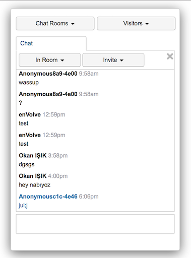

# Fireslack

[](http://badge.fury.io/gh/firebase%2Ffirechat)

Fireslack is a simple, extensible chat widget powered by [Firebase](https://www.firebase.com/?utm_source=firechat) and imitating [Slack's](https://slack.com/) UI.
It is intended to serve as a concise, documented foundation for chat products built on Firebase.
It works out of the box, and is easily extended.

## Live Demo

Visit [nhatbui.gitlab.io/whatpomade](https://nhatbui.gitlab.io/whatpomade) to see a live demo of Fireslack. (REQUIRES FB LOGIN!)



## Setup

Firechat uses [Firebase](https://www.firebase.com/?utm_source=firechat) as a backend, so it requires no server-side
code. It can be added to any web app by including a few JavaScript files, after building them.

In the root directory, build the project with [Grunt](http://gruntjs.com/).
```
grunt --force
```

The output files should be in ```dist/```.

```HTML
<!-- jQuery -->
<script src='https://cdnjs.cloudflare.com/ajax/libs/jquery/2.1.1/jquery.min.js'></script>

<!-- Firebase -->
<script src='https://cdn.firebase.com/js/client/2.1.0/firebase.js'></script>

<!-- Firechat -->
<link rel='stylesheet' href='dist/firechat.min.css' />
<script src='dist/firechat.min.js'></script>
```

giving your users a way to authenticate

```HTML
<script>
// Create a new Firebase reference, and a new instance of the Login client
var chatRef = new Firebase('https://<YOUR-FIREBASE>.firebaseio.com/chat');

function login() {
  chatRef.authWithOAuthPopup("twitter", function(error, authData) {
    if (error) {
      console.log(error);
    }
  });
}

chatRef.onAuth(function(authData) {
  // Once authenticated, instantiate Firechat with our user id and user name
  if (authData) {
    initChat(authData);
  }
});
</script>

<a href='#' onclick='login();'>Login with Twitter</a>
```
    
and initializing the chat.

```HTML
<script>
function initChat(authData) {
  var chat = new FirechatUI(chatRef, document.getElementById('firechat-wrapper'));
  chat.setUser(authData.uid, authData[authData.provider].displayName);
}
</script>

<div id='firechat-wrapper'></div>
```

For detailed integration instructions, see the [Firechat documentation](https://firechat.firebaseapp.com/docs/).

## Getting Started with Firebase

Firechat requires Firebase in order to store data. You can
[sign up here](https://www.firebase.com/signup/?utm_source=firechat) for a free account.

## Getting Help

If you have a question about Firechat, search the 
[Firebase tag on Stack Overflow](http://stackoverflow.com/questions/tagged/firebase) to see if it has already been 
answered. If it hasn't been asked, post a [new question](http://stackoverflow.com/questions/ask?tags=firebase+firechat). 
We keep a close eye on those tags, and will answer your question soon.

